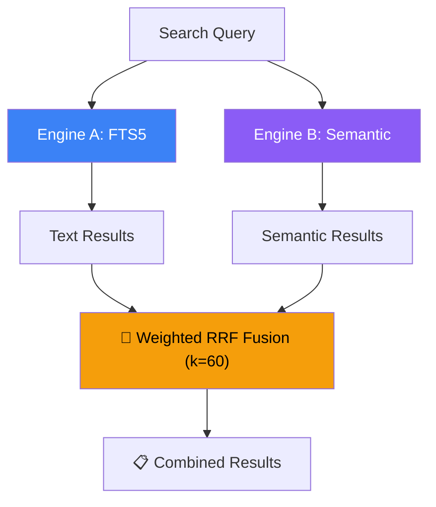

# Agents.md - Guide for AI Coding Assistants 🧠

This file provides critical context, instructions, and workflows for AI agents working on the **SmartMule** project.

## 🚀 Project Overview

**SmartMule** is an automated media library manager for P2P ecosystems (eMule, aMule). It monitors a download directory, identifies files using hashing (ED2K) and AI, verfies safety (VirusTotal), and organizes them into a clean library structure.

- **Stack**: Python 3.10+, SQLite, Watchdog (FS events), LLMs (Gemini/LM Studio).
- **Core Workflow**: Watcher → Fingerprinting → Semantic Analysis (AI) → API Enrichment (TMDB/OpenLibrary) → Organizer.

---

## 🛠️ Onboarding & Environment Setup

### 1. Python Dependencies
Agents should ensure a virtual environment is used and dependencies are installed from `requirements.txt`.
```bash
python -m venv venv
# Windows
.\venv\Scripts\activate
# Linux/macOS
source venv/bin/activate
pip install -r requirements.txt
```

### 2. System Dependencies (Required)
The project relies on external binaries. If they are missing, features *will* fail.
- **FFmpeg (ffprobe)**: For video duration/resolution extraction.
- **7-Zip (or Patool)**: For deep archive introspection.

### 3. Environment Configuration
Copy `.env.example` to `.env` and configure paths and API keys.
- `INCOMING_PATH`: Where eMule puts finished files.
- `LIBRARY_PATH`: Final destination for organized media.
- `TMDB_BEARER_TOKEN`: Required for movie/series metadata.
- `VIRUSTOTAL_API_KEY`: Required for security triage.

---

## 🏗️ Technical Architecture

### Core Components
- `main.py`: Entry point for both the daemon and the CLI control (start/stop).
- `smartmule/watcher.py`: Monitors `INCOMING_PATH` for new files.
- `smartmule/hasher.py`: Calculates ED2K hashes for precise P2P identification.
- `smartmule/metadata_engine.py`: Uses LLM to clean names and classifies media type.
- `smartmule/organizer.py`: Moves and renames files based on metadata.
- `smartmule/database.py`: Persists file status, metadata, and fingerprints.

### Key Logic: Tie-Breaking & Search

- **Tie-Breaking**: When an LLM provides multiple matches for a title, SmartMule uses `ffprobe` to compare file duration against TMDB data to select the correct production.

- **Fuzzy Search Optimization**: To prevent Python-based N+1 bottlenecks, fuzzy searches in `database.py` use a **SQL length pre-filter** (`LENGTH(...) BETWEEN X AND Y`) before calling the expensive Levenshtein function.

### Key Logic: Parallel Hashing (Performance)
The ED2K hashing in `smartmule/hasher.py` uses a hybrid model:
- **Sequential Reader**: Single-thread reads from disk to respect HDDs and `IOPRIO_VERYLOW`.
- **Parallel Workers**: `ThreadPoolExecutor` handles MD4 chunk calculations.
- **Backpressure**: The reader pauses if the thread pool buffer is full to prevent RAM exhaustion.

### Key Logic: Database Concurrency (WAL Mode)
SmartMule uses **SQLite Write-Ahead Logging (WAL)** to allow concurrent read and write operations.
- **Benefit**: You can perform `--search` or `--stats` (which provides breakdown by files and space per category in GB/MB) queries from the CLI while the background daemon is writing new records without encountering `database is locked` errors.
- **Sync Mode**: Set to `NORMAL` for a balance between safety and performance.

### Key Logic: Resource-Efficient Queue
The `smartmule/queue_manager.py` uses a single worker thread and a **Deferred Cleanup** mechanism.
- **No Thread Leaks**: Instead of spawning threads for delayed path release, it uses a timestamped queue (`collections.deque`) processed by the main worker.
- **Priority**: Files are processed by size (Smallest first) to provide immediate feedback for small media.

### Key Logic: I/O Resilience & SRP
- **Centralized Deletion**: All physical file operations (purge/reprocess) must go through `LibraryOrganizer.purge_item`.
- **Cross-Device Fallback**: The organizer detects `EXDEV` (cross-partition) errors and automatically falls back from `hardlink` to `copy` if necessary.
- **Fast Watcher**: Directory inspection uses shallow `iterdir()` instead of recursive `rglob` to avoid blocking the OS event observer.

### Key Logic: P2P Metadata Handling
SmartMule treats P2P operational files (`.torrent`, `.emulecollection`) as valuable but non-media assets.
- **Categorization**: These extensions are mapped to the `info` category in `regex_parser.py`.
- **Organization**: They are automatically moved to the `Library/Info` (or `Library/Metadata`) subfolder to keep the main media directories clean while preserving the download source information.

---

## 🧪 Testing & Validation

Run the test suite before any major PR/Push:
```bash
pytest -v --tb=short
```
Tests are located in `/tests` and use mock objects for external APIs and file system events.

---

## 📋 Development Guidelines

1. **Bilingual Documentation**: Keep `README.md` (Spanish) and `README_EN.md` (English) in sync.
2. **Error Resilience**: Use exponential backoff for API calls (see `smartmule/api/`).
3. **Log Integrity**: Maintain `smartmule.log` for debugging the background daemon.
4. **No Placeholders**: Never use placeholder text in generated code or documentation.

---

## 🛠️ Workflows for Agents

### How to Start/Stop/Restart the Service (Windows Daemon)
- **Start**: Run `python main.py start` (standard) or `smartmule_launcher.vbs` (invisible).
- **Stop**: Run `python main.py stop`. This looks for the persistent PID and shuts down the watcher cleanly.
- **Restart**: Run `python main.py restart`. Useful after updating cleaning rules or API keys.

### How to Purge/Delete Files
Use the purge command to delete files from both `Incoming` and `Library` folders simultaneously.
- **Search & Destroy**: `python main.py --purge "search_term"`.
- **Wipe Everything**: `python main.py --purge --all --no-preserve`. This requires a manual string confirmation ("BORRAR TODO").

### How to Force Re-processing (Invalidate Cache)
If a file was incorrectly identified or you updated the parsing logic, use:
- **Reprocess**: `python main.py --reprocess "query"`.
  - **What it does**: Deletes the database record, clears the metadata cache (LLM/API), and removes the hardlink from the `Library`.
  - **Result**: The original file in `Incoming` remains, and SmartMule will treat it as a brand new file in the next scan.

- **Special Note on Hardlinks**: When using `hardlink` mode (default), files exist in both locations. The purge command removes them from both locations and the database.

### How to Search Files
SmartMule uses a Hybrid Search Engine that blends **FTS5** (_Full-Text Search_) for high-performance lexical indexing and **FastEmbed/ONNX** for Semantic Vectorial search.

- **Query**: `python main.py --search "query_term"`.
- **Features**: Diacritic-insensitive (accent agnostic), prefix matching, regex fallback, and **Filtered Search**.
- **Filters Syntax**: Supports `type:movie`, `score>8`, `verdict:safe`, `res:1080p`, `organized:yes`.
- **Hybrid Fusion (Weighted RRF)**: Combines text match (1.5x weight) and semantic match (1.0x weight) using Reciprocal Rank Fusion.



### How to Add a New Category
1. Add classification logic to `smartmule/metadata_engine.py`.
2. Define the folder structure in `smartmule/organizer.py`.
3. Add relevant tests in `tests/`.

---

> [!IMPORTANT]
> Always verify that `FFmpeg` and `7-Zip` are in the system `PATH` if debugging extraction or metadata errors.
