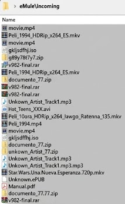

# SmartMule 🧠

### El Bibliotecario Inteligente para el Ecosistema P2P

**SmartMule** es un servicio automatizado en segundo plano diseñado para transformar el caos de las descargas P2P (eMule) en una biblioteca de medios perfectamente estructurada. Utiliza una combinación de vigilancia del sistema de archivos, hashing criptográfico e Inteligencia Artificial para clasificar, renombrar y proteger tus archivos.

## ¿Qué problemas resuelve?

El problema histórico de eMule es la desorganización: archivos con nombres crípticos (ej. `Peli_1994_HDRip_x264_ES.mkv`) amontonados en una única carpeta `Incoming`. 

SmartMule actúa como una herramienta que:

1. **Vigila** constantemente tu carpeta de descargas.

2. **Identifica** la identidad real del archivo mediante su "DNI digital" (su Hash ED2K).

3. **Limpia** el nombre usando IA (Gemini o modelos locales).

4. **Organiza** el contenido en carpetas lógicas (Películas, Series, Libros, Software), enriqueciendo los metadatos mediante APIs externas.

---

## Utilidades Principales

*   **Organización Automática:** Clasifica archivos por categoría y género sin intervención humana.

*   **Limpieza de "Texto Sucio":** Elimina automáticamente etiquetas de la *scene* (HDRip, x264, grupos de ripeo) para dejar títulos limpios.

*   **Seguridad y Anti-Fake:** 
    *   Detecta archivos falsos comparando la duración real del video con los metadatos oficiales.
    *   Realiza triaje de seguridad en ejecutables (`.exe`) verificando firmas digitales.

*   **Privacidad Total:** Opción de procesar todo mediante modelos de lenguaje locales (vía LM Studio/Mistral) para no enviar datos a la nube.

*   **Bajo Consumo de Recursos:** Optimizado para hardwares de gama baja, utilizando colas de prioridad (_Priority Queues_) para no saturar el disco duro.

---

## Cómo funciona (El Pipeline)

1.  **Monitorización:** `Watchdog` detecta la llegada de un archivo a `Incoming`.

2.  **Verificación de Identidad:** Se calcula el Hash ED2K y se busca en la base de datos local.

3.  **Procesamiento de IA:** Un LLM analiza el nombre sucio y extrae el título y el tipo de contenido.

4.  **Enriquecimiento:** Se consulta **TMDB** (cine) u **OpenLibrary** (libros) para obtener año, género y carátulas.

5.  **Operación Atómica:** El archivo se mueve y renombra a su destino final siguiendo un patrón estándar (ej. `/Peliculas/Ciencia Ficcion/Matrix (1999).mkv`).

---

## Stack tecnológico usado

*   **Lenguaje:** Python 3.10+
*   **IA:** Gemini API (Cloud) / Mistral-7B (Local vía LM Studio)
*   **APIs:** TMDB, OpenLibrary
*   **Librerías clave:** `watchdog` (Eventos), `pefile` (Seguridad), `psutil` (Optimización), `streamlit` (Dashboard).

---

> Traducción futura a inglés para el repositorio de GitHub