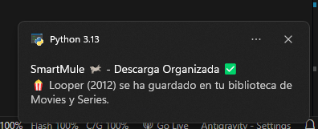

[ 🇪🇸 Castellano ](README.md) | [ 🇺🇸 English ](README_EN.md)

# SmartMule 🫏

### El Bibliotecario Inteligente para el Ecosistema P2P

**SmartMule** es un servicio automatizado de organización y seguridad diseñado para transformar el caos de las descargas P2P (eMule, aMule, etc.) en una biblioteca perfectamente estructurada. Utiliza vigilancia del sistema de archivos, hashing criptográfico (ED2K) e Inteligencia Artificial para clasificar, limpiar y proteger tu equipo de amenazas camufladas.




---

## ¿Es realmente necesario?

Por defecto, eMule deposita todas las descargas finalizadas en una única carpeta `Incoming`. Con el tiempo, este directorio se convierte en un caos de películas, software, música y archivos con nombres crípticos. 

**SmartMule** soluciona este problema identificando, limpiando y moviendo cada archivo a su categoría temática correspondiente de forma automática, manteniendo tu biblioteca organizada sin esfuerzo manual.

---

## Características Principales

*   **Vigilancia Activa (Watchdog)**: Detecta archivos nuevos en tu carpeta `Incoming` al instante.

*   **Doble Capa de Verificación**: Identifica archivos por su nombre (IA) y por su contenido (Hash ED2K / Fingerprint). 

*   **Soporte de Directorios (Folder Grouping)**: SmartMule detecta si una descarga es una carpeta (ej: película con subtítulos). Identifica el archivo principal para el hashing y los metadatos, pero mueve y renombra **toda la carpeta** como una única unidad funcional.

*   **Antimalware Semántico (Triaje de Élite)**: Inspección profunda de archivos sin extracción usando **VirusTotal**. SmartMule no se fía de nadie:
    -   **Análisis de Macros**: Detecta documentos de Office con macros (`.xlsm`, `.docm`, etc.) y formatos antiguos (`.doc`, `.xls`) tratándolos como ejecutables.
    -   **Vigilancia de PDF**: Escaneo automático de archivos PDF ante scripts maliciosos.
    -   **Inspección de Contenedores**: El `ArchiveInspector` analiza archivos `.zip`, `.rar` y `.7z` buscando inconsistencias (ej: un `.exe` disfrazado de película) y mostrando el contenido sospechoso en los logs.
    -   **Puntuaciones Críticas**: Si un archivo tiene más de 5 detecciones en VT (priorizando motores TOP como Microsoft o Kaspersky), lo mueve a **Review** para evitar riesgos.

*   **Desempate Inteligente (Tie-Breaking)**: Usa la duración real de los videos para distinguir entre películas homónimas (ej: Solaris 1972 vs Solaris 2002).

*   **Triaje Automático**: 
    -   `MALICIOUS`: Borrado automático destructivo.
    -   `SUSPICIOUS`: Cuarentena para revisión manual.
    -   `SAFE`: Organización temática automatizada.

    
    


*   **Privacidad**: Compatible con modelos locales (LM Studio) para procesar nombres sin subirlos a la nube.

---

## 🛠️ Requisitos del Sistema

### 1. Dependencias de Python

Instala las librerías necesarias con:
```bash
pip install -r requirements.txt
```

### 2. Herramientas de Sistema (OBLIGATORIO)

Para el análisis de archivos y desempate de películas, SmartMule requiere:

*   **FFmpeg (ffprobe)**: Necesario para extraer la duración y resolución de los videos.
    -   **Windows**: Descarga de [ffmpeg.org](https://ffmpeg.org/download.html), extrae el `.zip` y añade la carpeta `bin` al `PATH` de tu sistema.
    -   **Linux**: `sudo apt install ffmpeg`

*   **7-Zip / Patool**: Necesario para inspeccionar archivos comprimidos.
    -   **Windows**: Instala [7-Zip](https://www.7-zip.org/) y asegúrate de que esté en el `PATH`.
    -   **Linux**: `sudo apt install p7zip-full`

---

## Cómo funciona (El Pipeline de Datos)

1.  **Monitorización**: El `Watcher` detecta el archivo e inicia una espera de desbloqueo (_I/O unlock_).

2.  **Caché Inteligente**: Se calcula una "Fingerprint" rápida. Si el archivo ya existe y el `mtime` (_modification time_) no ha cambiado, se reutilizan los metadatos para ahorrar APIs.

3.  **Análisis Semántico**: Si es un contenedor, el `ArchiveInspector` busca amenazas antes de que el usuario lo abra.

4.  **Capa IA (LLM)**: Limpia el nombre "sucio" de la _Scene_ y detecta el tipo de medio (Cine, Música, Libros, Software, etc.).

5.  **Enriquecimiento (API)**: Consulta **TMDB** u **OpenLibrary** usando el año y la duración para un emparejamiento perfecto.

6.  **Organización**: El `LibraryOrganizer` mueve el archivo a su destino final (ej: `/Library/Movies_and_Series/Matrix (1999).mkv`).

---

## Daemon (Ejecución en Segundo Plano)

SmartMule está diseñado para ejecutarse una sola vez y quedarse vigilando permanentemente de forma completamente invisible.

*   **Arrancar (Modo Invisible)**: Haz doble clic en el archivo `smartmule_launcher.vbs`. Esto levantará el proceso en segundo plano. Recomiendo crear un acceso directo a este archivo y colocarlo en tu carpeta de *Autoinicio de Windows* (`shell:startup`) para que arranque solo al encender el PC.

*   **Detener**: Si necesitas pararlo, abre una terminal cualquiera (CMD o PowerShell) y ejecuta `python main.py stop`. SmartMule detectará el proceso oculto y lo cerrará limpiamente.


*   **Auditoría**: Toda la actividad silenciosa quedará registrada en el archivo `smartmule.log` (en la raíz del proyecto). Puedes seguirlo en tiempo real en la terminal ejecutando:
    ```powershell
    Get-Content smartmule.log -Wait -Encoding UTF8
    ```


---

## Configuración en eMule (IMPORTANTE)

Para no perder visibilidad en la red ni dejar de ganar créditos tras la organización de tus archivos, sigue estos pasos:

1.  **Compartir Biblioteca**: Ve a eMule > **Opciones** > **Directorios** y marca la carpeta `Library` como directorio compartido (asegúrate de incluir sus subcarpetas).


2.  **Privacidad**: No compartas la carpeta raíz de SmartMule, solo la carpeta `Library`. SmartMule guarda su base de datos en una carpeta oculta (`.data`) para que eMule no la indexe.

3.  **Mantener Créditos**: Tus créditos están asociados a tu *User Identification* (Hash), no a los nombres de los archivos. Al compartir la `Library` con los archivos ya limpios y renombrados, eMule reconocerá que tienes el mismo contenido (mismo Hash ED2K) y seguirás sumando prioridad de subida.

---

## Configuración para Torrents (BitTorrent, uTorrent, qBittorrent)

SmartMule es totalmente compatible con gestores de descargas Torrent. Debido a que las redes Torrent detienen el *seeding* (compartir) si cambias el archivo de sitio, SmartMule usa por defecto la creación de **Hardlinks** para los archivos de estas redes, asegurando que puedas seguir compartiendo (_Seeding_) los archivos sin interrupciones.

1.  **Ajustes de Extensiones (Crucial)**: Para prevenir que SmartMule procese archivos sin terminar, es obligatorio que actives la opción de de tu cliente de Torrent para agregar una extensión a las descargas incompletas. (Ej. *`Append .!ut to incomplete files`* en uTorrent o *`Añadir !qB a descargas incompletas`* en qBittorrent).

    

2.  **Mismo Disco**: Los _Hardlinks_ exigen que la carpeta `Incoming` y la `Library` estén en la misma partición del sistema o disco duro.

3.  **Configuración de Modo**: Puedes alterar el comportamiento modificando la variable `ORGANIZER_MODE` en tu `.env` (`hardlink` por defecto, pudiendo elegir `copy` o `move`).

---

## Testing

SmartMule cuenta con una suite de pruebas para garantizar la estabilidad:
```bash
pytest -v --tb=short
```


---
