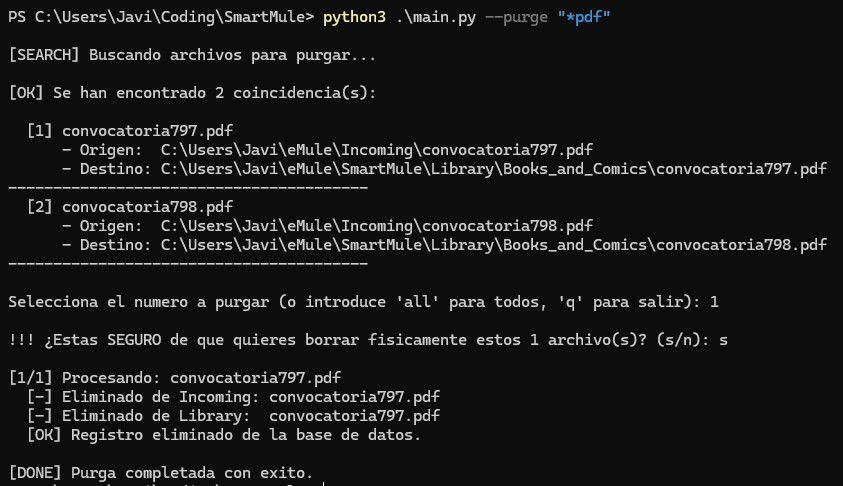
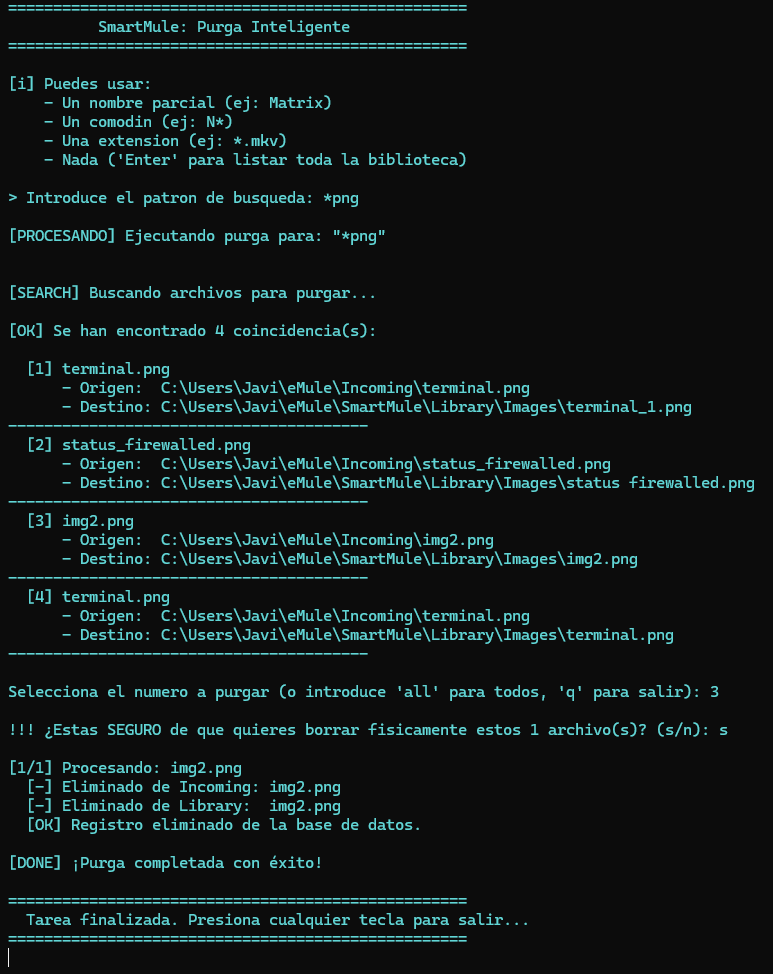
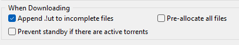

[ 🇪🇸 Castellano ](README.md) | [ 🇺🇸 English ](README_EN.md)

# SmartMule 🫏

### El Bibliotecario Inteligente para el Ecosistema P2P

**SmartMule** es un servicio automatizado de organización y seguridad diseñado para transformar el caos de las descargas P2P (eMule, aMule, etc.) en una biblioteca perfectamente estructurada. Utiliza vigilancia del sistema de archivos, hashing criptográfico (ED2K) e Inteligencia Artificial para clasificar, limpiar y proteger tu equipo de amenazas camufladas.


---

## ¿Es realmente necesario?

Por defecto, eMule deposita todas las descargas finalizadas en una única carpeta `Incoming`. Con el tiempo, este directorio se convierte en un caos de películas, software, música y archivos con nombres crípticos. 

**SmartMule** soluciona este problema identificando, limpiando y moviendo cada archivo a su categoría temática correspondiente de forma automática, manteniendo tu biblioteca organizada sin esfuerzo manual.

---

## Características Principales

*   **Vigilancia Activa (Watchdog)**: Detecta archivos nuevos en tu carpeta `Incoming` al instante.

*   **Doble Capa de Verificación**: Identifica archivos por su nombre (IA) y por su contenido (Hash ED2K / Fingerprint). 

*   **Soporte de Directorios (Folder Grouping)**: SmartMule detecta si una descarga es una carpeta (ej: película con subtítulos). Identifica el archivo principal para el hashing y los metadatos, pero mueve y renombra **toda la carpeta** como una única unidad funcional.

*   **Antimalware Semántico (Triaje de Élite)**: Inspección profunda de archivos sin extracción usando **VirusTotal**. SmartMule no se fía de nadie:
    -   **Análisis de Macros**: Detecta documentos de Office con macros (`.xlsm`, `.docm`, etc.) y formatos antiguos (`.doc`, `.xls`) tratándolos como ejecutables.
    -   **Vigilancia de PDF**: Escaneo automático de archivos PDF ante scripts maliciosos.
    -   **Inspección de Contenedores**: El `ArchiveInspector` analiza archivos `.zip`, `.rar` y `.7z` buscando inconsistencias (ej: un `.exe` disfrazado de película) y mostrando el contenido sospechoso en los logs.
    -   **Puntuaciones Críticas**: Si un archivo tiene más de 5 detecciones en VT (priorizando motores TOP como Microsoft o Kaspersky), lo mueve a **Review** para evitar riesgos.

*   **Desempate Inteligente (Tie-Breaking)**: Utiliza un sistema de scoring heurístico basado en el año de estreno y la duración técnica (FFmpeg) para distinguir entre películas homónimas (ej: Solaris 1972 vs Solaris 2002).

*   **Búsqueda Inteligente (FTS5)**: Motor de búsqueda global integrado con soporte para filtros. Localiza cualquier archivo por título, tipo, puntuación o resolución al instante.
    ```bash
    python main.py --search "Matrix"               # Búsqueda por nombre o título
    python main.py --search "type:movie score>8"  # Búsqueda con filtros
    ```

*   **Triaje Automático**: 
    -   `SAFE`: Organización temática automatizada.
    -   `SUSPICIOUS`: Cuarentena para revisión manual.
    -   `MALICIOUS`: Borrado automático destructivo.

    
    

*   **Privacidad**: Compatible con modelos locales (LM Studio) para procesar nombres sin subirlos a la nube.

*  **Gasto de recursos muy bajo**: SmartMule está diseñado para ejecutarse en segundo plano sin interferir con el uso normal del PC. Establece una prioridad de I/O (`IOPRIO_VERYLOW`) y CPU (`IDLE_PRIORITY_CLASS`) mínimas. Además, utiliza el modo **SQLite WAL** para permitir búsquedas instantáneas incluso mientras el motor está organizando archivos pesados.

---

### 📂 Estrategias de Organización (`ORGANIZER_MODE`)

SmartMule permite elegir cómo se gestionan los archivos físicamente mediante la variable `ORGANIZER_MODE` en el archivo `.env`:

| Modo | Soporta _Seeding_ (eMule) | Descripción |
| :--- | :--- | :--- |
| **`hardlink`** (Por defecto) | ✅ **Sí** | Crea un vínculo físico. El archivo aparece en `Incoming` y `Library` pero **solo ocupa espacio una vez**. |
| **`move`** | ❌ **No** | Mueve el archivo. eMule dejará de compartirlo al no encontrarlo en la ruta original. |
| **`copy`** | ✅ **Sí** | Duplica el archivo. Consume el doble de espacio pero funciona entre discos físicos distintos. |

>[!TIP]
> Usa **`hardlink`** siempre que `Incoming` y `Library` estén en el mismo disco duro.

---

## 🛠️ Requisitos del Sistema

### Dependencias de Python

Instala las librerías necesarias con:
```bash
pip install -r requirements.txt
```

### Herramientas de Sistema (OBLIGATORIO)

Para el análisis de archivos y desempate de películas, SmartMule requiere:

*   **FFmpeg (ffprobe)**: Necesario para extraer la resolución y metadatos técnicos de los videos.
    -   **Windows**: Descarga de [ffmpeg.org](https://ffmpeg.org/download.html), extrae el `.zip` y añade la carpeta `bin` al `PATH` de tu sistema.
    -   **Linux**: `sudo apt install ffmpeg`

*   **7-Zip / Patool**: Necesario para inspeccionar archivos comprimidos.
    -   **Windows**: Instala [7-Zip](https://www.7-zip.org/) y asegúrate de que esté en el `PATH`.
    -   **Linux**: `sudo apt install p7zip-full`

---

## Cómo funciona (El Pipeline de Datos)

1.  **Monitorización**: El `Watcher` detecta el archivo.
2.  **Caché Inteligente**: Se calcula una "Fingerprint" rápida para evitar duplicar análisis.
3.  **Análisis Semántico**: El `ArchiveInspector` busca amenazas en contenedores.
4.  **Capa IA (LLM)**: Limpia el nombre y detecta el tipo de medio.
5.  **Enriquecimiento (API)**: Consulta **TMDB** u **OpenLibrary**.
6.  **Organización**: El `LibraryOrganizer` mueve el archivo a su destino final.

---

## Daemon (Ejecución en Segundo Plano)

SmartMule está diseñado para ejecutarse una sola vez y quedarse vigilando permanentemente de forma completamente invisible.

*   **Arrancar (Modo Invisible)**: 

    - **Windows**: Haz doble clic en el archivo `smartmule_launcher.vbs`. Recomiendo colocar un acceso directo en tu carpeta de *Autoinicio* (`shell:startup`).
    
    - **Linux**: Ejecuta `./smartmule_launcher.sh`. Este script usa `nohup` para que el proceso siga vivo aunque cierres la terminal.

*   **Detener**: Ejecuta `python3 main.py stop`. SmartMule detectará el proceso oculto y lo cerrará limpiamente.

    

*   **Auditoría**: Toda la actividad silenciosa quedará registrada en el archivo `smartmule.log`. Puedes ver las últimas líneas rápidamente con:
    ```bash
    python main.py --log      # Muestra las últimas 30 líneas (por defecto)
    python main.py --log 100  # Muestra las últimas 100 líneas
    ```
    O seguirlo en tiempo real en Windows:
    ```powershell
    Get-Content smartmule.log -Wait -Encoding UTF8
    ```

    

*   **Inventario y Estadísticas**: Para ver rápidamente qué archivos están registrados en la biblioteca, el desglose por categorías (Películas, Libros, etc.) y el tamaño total ocupado, usa el flag `--stats`. Para verificar el estado de salud y dependencias del sistema, usa `--status`. Si quieres verificar qué rutas y APIs tienes activas, usa `--config`:
    ```bash
    python main.py --stats     # Ver estadísticas
    python main.py --status    # Chequear salud del sistema
    python main.py --config    # Ver configuración activa
    ```

    

### Alias en Linux

Para evitar escribir la ruta del entorno virtual cada vez que quieras usar la CLI, puedes crear un alias en tu terminal:

1.  Abre tu configuración: `nano ~/.bashrc`

2.  Pega esta línea al final (ajusta la ruta si es necesario):
    ```bash
    alias smartmule='/home/user/SmartMule/venv/bin/python3 /home/user/SmartMule/main.py'
    ```
3.  Recarga la configuración: `source ~/.bashrc`

### Alias en Windows

Si quieres que el comando `smartmule` funcione tanto en **PowerShell** como en **CMD**:

1.  Crea un archivo llamado `smartmule.bat` en una carpeta que esté en tu `PATH` (ej: `C:\Windows`).

2.  Pega este contenido dentro (ajusta las rutas a tu instalación):
    ```batch
    @echo off
    C:\SmartMule\venv\Scripts\python.exe C:\SmartMule\main.py %*
    ```

3.  ¡Listo! Ahora puedes usar los comandos simplificados desde cualquier terminal.

### Comandos disponibles (vía Alias)

Una vez configurado el alias, podrás usar desde cualquier terminal:
*   `smartmule start` (Arranca el motor de SmartMule)
*   `smartmule stop` (Detiene el servicio)
*   `smartmule restart` (Reinicia el servicio)
*   `smartmule --stats` (Ver inventario y estadísticas de almacenamiento)
*   `smartmule --status` (Ver salud y dependencias del sistema)
*   `smartmule --config` (Ver rutas y configuración de APIs activas)
*   `smartmule --purge "Nombre"` (Borrar archivos)
*   `smartmule --reprocess "Nombre"` (Forzar re-análisis de un archivo)
*   `smartmule --debug` (Arranca con logs detallados de IA)
*   `smartmule --pid`  (Muestra el PID del proceso activo)
*   `smartmule --search [consulta]` (Búsqueda por nombre o título)

---

## Mantenimiento y Purga (_Smart Deletion_)

_Cuando usas el modo `hardlink` (predeterminado), borrar un archivo de tu biblioteca no lo borra físicamente del disco si aún existe en la carpeta `Incoming` (y viceversa). Esto es necesario para seguir compartiendo como cliente eMule (y ganar créditos en la red), pero puede ser tedioso de limpiar_. 

Para facilitar la limpieza total, SmartMule incluye un comando de purga/eliminación de archivos:

*   **Purga Selectiva**: Busca archivos por nombre, comodines (_Wildcards_) o expresiones regulares (_Regex_). 
    ```bash
    python main.py --purge "nombre*"  # Encuentra archivos que empiecen por "nombre"
    python main.py --purge ".*\.mkv$" # Encuentra todos los archivos con extensión .mkv
    ```

*   **Explorador Interactivo**: Si ejecutas el comando sin términos de búsqueda, SmartMule te mostrará la lista completa de tu biblioteca para que elijas qué eliminar.
    ```bash
    python main.py --purge
    ```

Ejemplo de uso:


*   **Modo Destructivo (Limpieza Total)**: ⚠️⚠️ Borra absolutamente todos los archivos registrados en la base de datos de un solo golpe.
    ```bash
    python main.py --purge --all --no-preserve
    ```
    *Nota: Este comando requiere una confirmación de texto (escribir "BORRAR TODO") por seguridad.*

### 🔄 Re-procesamiento (Forzar identificación)
A veces, un archivo puede clasificarse erróneamente (ej: como "Video" genérico) porque el título estaba demasiado "sucio" o la llamada a la API falló. Si actualizas SmartMule o mejoras tus reglas de limpieza, puedes forzar que se vuelva a analizar desde cero:

*   **Comando**: `smartmule --reprocess "Nombre"`
*   Elimina el registro de la BBDD, borra la caché de la IA y elimina el archivo de la `Library`. El archivo original en `Incoming` permanece intacto. SmartMule lo detectará como un archivo nuevo y aplicará el pipeline de identificación completo de nuevo. 
    _(💡 Nota: Es recomendable ejecutar `smartmule restart` tras este comando para forzar el re-escaneo inmediato)._

### 🚀 Purga en un solo clic (Multiplataforma)
Para mayor comodidad, SmartMule despliega automáticamente herramientas de acceso directo dentro de tu carpeta de biblioteca (`LIBRARY_PATH`):

*   **Windows**: Usa **`Purga_Interactiva.bat`**.
*   **Linux**: Usa **`purga_interactiva.sh`**.

Solo tienes que ejecutar el archivo correspondiente para buscar y eliminar archivos sin tener que recordar comandos complejos:


---

## Configuración en eMule (IMPORTANTE)

Para no perder visibilidad en la red ni dejar de ganar créditos tras la organización de tus archivos, sigue estos pasos:

1.  **Compartir Biblioteca**: Ve a eMule > **Opciones** > **Directorios** y marca la carpeta `Library` como directorio compartido (asegúrate de incluir sus subcarpetas).


2.  **Privacidad**: No compartas la carpeta raíz de SmartMule, solo la carpeta `Library`. SmartMule guarda su base de datos en una carpeta oculta (`.data`) para que eMule no la indexe.

3.  **Mantener Créditos**: Tus créditos están asociados a tu *User Identification* (Hash), no a los nombres de los archivos. Al compartir la `Library` con los archivos ya limpios y renombrados, eMule reconocerá que tienes el mismo contenido (mismo Hash ED2K) y seguirás sumando prioridad de subida.

---

## Configuración para Torrents (BitTorrent, uTorrent, qBittorrent)

SmartMule es totalmente compatible con gestores de descargas Torrent. Debido a que las redes Torrent detienen el *seeding* (compartir) si cambias el archivo de sitio, SmartMule usa por defecto la creación de **Hardlinks** para los archivos de estas redes, asegurando que puedas seguir compartiendo (_Seeding_) los archivos sin interrupciones.

1.  **Ajustes de Extensiones (Crucial)**: Para prevenir que SmartMule procese archivos sin terminar, es obligatorio que actives la opción de de tu cliente de Torrent para agregar una extensión a las descargas incompletas. (Ej. *`Append .!ut to incomplete files`* en uTorrent o *`Añadir !qB a descargas incompletas`* en qBittorrent).

    

2.  **Mismo Disco**: Los _Hardlinks_ exigen que la carpeta `Incoming` y la `Library` estén en la misma partición del sistema o disco duro.

3.  **Configuración de Modo**: Puedes alterar el comportamiento modificando la variable `ORGANIZER_MODE` en tu `.env` (`hardlink` por defecto, pudiendo elegir `copy` o `move`).

---

## Testing

SmartMule cuenta con una suite de pruebas para garantizar la estabilidad:
```bash
pytest -v --tb=short
```

---

## 🚀 Motor de Hashing Paralelo (Optimización)

SmartMule incluye un **motor de hashing ED2K de alto rendimiento** diseñado para no saturar tu sistema, que reduce el tiempo de cálculo del hash de forma exponencial:

-   **Arquitectura Híbrida**: Lectura secuencial de disco (`IOPRIO_VERYLOW`) combinada con cálculo paralelo mediante hilos (`multi-threading`)

-   **Control de RAM**: Sistema de _Backpressure_ que garantiza un consumo de memoria mínimo y constante (~55MB), sin importar si procesas un archivo de 1GB o una ISO de 200GB.

-   **Cortesía con el SO**: Ajusta automáticamente la prioridad de la CPU (`IDLE`) y limita el uso al 50% de tus núcleos, asegurando que el sistema sea totalmente fluido incluso durante tareas intensivas.

---
