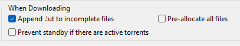

[ 🇺🇸 English ](README_EN.md) | [ 🇪🇸 Castellano ](README.md)

# SmartMule 🫏

### The Intelligent Librarian for the P2P Ecosystem

**SmartMule** is an automated organization and security service designed to transform the chaos of P2P downloads (eMule, aMule, etc.) into a perfectly structured library. It uses file system monitoring, cryptographic hashing (ED2K), and Artificial Intelligence to classify, clean, and protect your computer from disguised threats.


---

## Why?

By default, eMule places all completed downloads into a single `Incoming` folder. Over time, this directory becomes a chaotic mix of movies, software, music, and archives with cryptic "scene" names. 

**SmartMule** solves this by automatically identifying, cleaning, and moving each file into its proper thematic category, keeping your library organized without manual effort.

---

## Key Features

*   **Active Surveillance (Watchdog)**: Instantly detects new files in your `Incoming` folder.

*   **Dual-Layer Verification**: Identifies files by name (AI) and by content (ED2K Hash / Fingerprint). 
+
+*   **Directory Support (Folder Grouping)**: SmartMule detects if a download is a folder (e.g., a movie with subtitles). It identifies the main file for hashing and metadata but moves and renames the **entire folder** as a single functional unit.

*   **Semantic Antimalware**: Deep inspection of compressed files (`.zip`, `.rar`, `.7z`) without extraction, using VirusTotal. Features an **Smart Triage** system that prioritizes detections from TOP engines (Microsoft, Kaspersky, ESET, etc.) for zero-tolerance security against modern threats.

*   **Intelligent Tie-Breaking**: Uses real video duration to distinguish between homonymous movies (e.g., Solaris 1972 vs Solaris 2002).

*   **Automated Triage**: 
    -   `MALICIOUS`: Automatic destructive deletion.
    -   `SUSPICIOUS`: Quarantine for manual review.
    -   `SAFE`: Automated thematic organization and renaming.
    
    

*   **Privacy**: Compatible with local models (LM Studio) to process names without uploading them to the cloud.

---

## System Requirements

### 1. Python Dependencies

Install the necessary libraries with:
```bash
pip install -r requirements.txt
```

### 2. System Tools (MANDATORY)

For file analysis and movie tie-breaking, SmartMule requires:

*   **FFmpeg (ffprobe)**: Needed to extract video duration and resolution.
    -   **Windows**: Download from [ffmpeg.org](https://ffmpeg.org/download.html), extract the `.zip`, and add the `bin` folder to your system `PATH`.
    -   **Linux**: `sudo apt install ffmpeg`

*   **7-Zip / Patool**: Needed to inspect compressed files.
    -   **Windows**: Install [7-Zip](https://www.7-zip.org/) and ensure it is in the `PATH`.
    -   **Linux**: `sudo apt install p7zip-full`

---

## How it Works (Data Pipeline)

1.  **Monitoring**: The `Watcher` detects the file and starts an I/O unlock wait.

2.  **Smart Cache**: A fast "Fingerprint" is calculated. If the file already exists and the `mtime` (modification time) has not changed, metadata is reused to save API calls.

3.  **Semantic Analysis**: If it's a container, the `ArchiveInspector` looks for threats before the user opens it.

4.  **AI Layer (LLM)**: Cleans the "dirty" scene filename and detects the media type (Movies, Music, Books, Software, etc.).

5.  **Enrichment (API)**: Queries **TMDB** or **OpenLibrary** using the year and duration for a perfect match.

6.  **Organization**: The `LibraryOrganizer` moves and renames the file to its final destination (e.g., `/Library/Movies_and_Series/The Matrix (1999).mkv`).

---

## Daemon (Background Execution)

SmartMule is designed to run once and remain monitoring permanently in a completely invisible manner.

*   **Start (Invisible Mode)**: Double-click the `smartmule_launcher.vbs` file. This will launch the background process. I recommend creating a shortcut to this file and placing it in your *Windows Startup* folder (`shell:startup`) so it starts automatically when you turn on your PC.

*   **Stop**: If you need to stop it, open any terminal (CMD or PowerShell) and run `python main.py stop`. SmartMule will detect the hidden process and close it cleanly.


*   **Auditing**: All silent activity will be recorded in the `smartmule.log` file (in the project root). You can follow it in real-time in the terminal by running:
    ```powershell
    Get-Content smartmule.log -Wait -Encoding UTF8
    ```


---

## eMule Configuration (IMPORTANT)

To maintain visibility on the network and continue earning credits after organizing your files, follow these steps:

1.  **Share Library**: Go to eMule > **Options** > **Directories** and mark the `Library` folder as a shared directory (ensure you include its subfolders).


2.  **Privacy**: Do not share the SmartMule root folder, only the `Library` folder. SmartMule stores its database in a hidden folder (`.data`) so that eMule does not index it.

3.  **Maintain Credits**: Your credits are associated with your *User Identification* (Hash), not file names. By sharing the `Library` with cleaned and renamed files, eMule will recognize that you have the same content (same ED2K Hash) and you will continue to accumulate upload priority.

4.  **Update**: After starting SmartMule for the first time, go to eMule's **Shared Files** tab and click the **Reload** button so that the new names appear on the network instantly.

---

## Torrent Configuration (BitTorrent, uTorrent, qBittorrent)

SmartMule is fully compatible with Torrent download managers. Because Torrent networks stop *seeding* (sharing) if you change the file's location, SmartMule defaults to creating **Hardlinks** for files coming from these networks, ensuring that you can continue sharing (_Seeding_) the files without interruptions.

1.  **Extensions Settings (Crucial)**: To prevent SmartMule from processing unfinished files, it is mandatory that you enable the option in your Torrent client to add an extension to incomplete downloads. (e.g. *`Append .!ut to incomplete files`* in uTorrent or *`Append .!qB to incomplete files`* in qBittorrent).

    

2.  **Same Drive**: _Hardlinks_ require that both the `Incoming` folder and the `Library` folder reside on the same system partition or hard drive.

3.  **Mode configuration**: You can alter the behavior by modifying the `ORGANIZER_MODE` variable in your `.env` (`hardlink` by default, but you can choose `copy` or `move`).

---

## Testing

SmartMule includes a test suite to ensure stability:
```bash
pytest -v --tb=short
```


---
